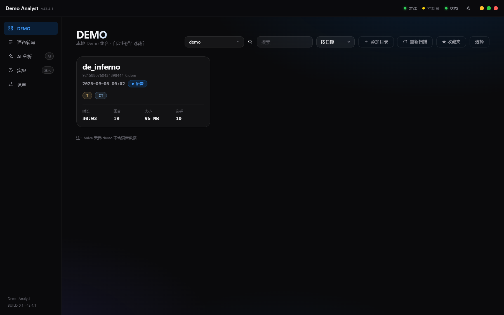
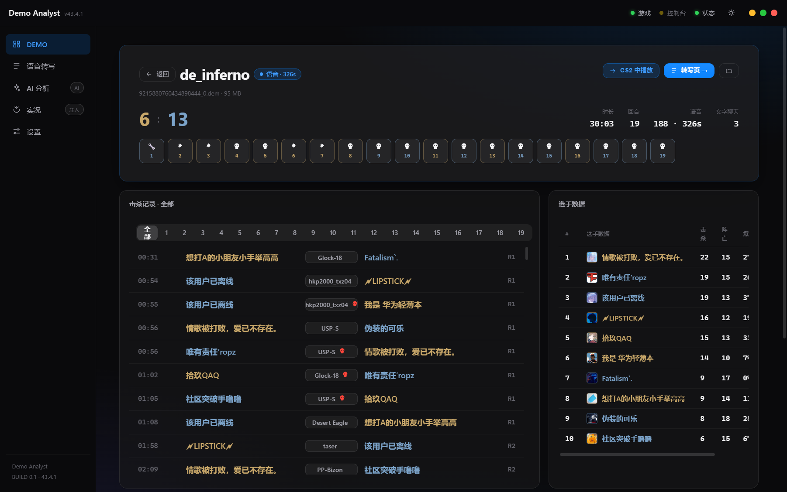
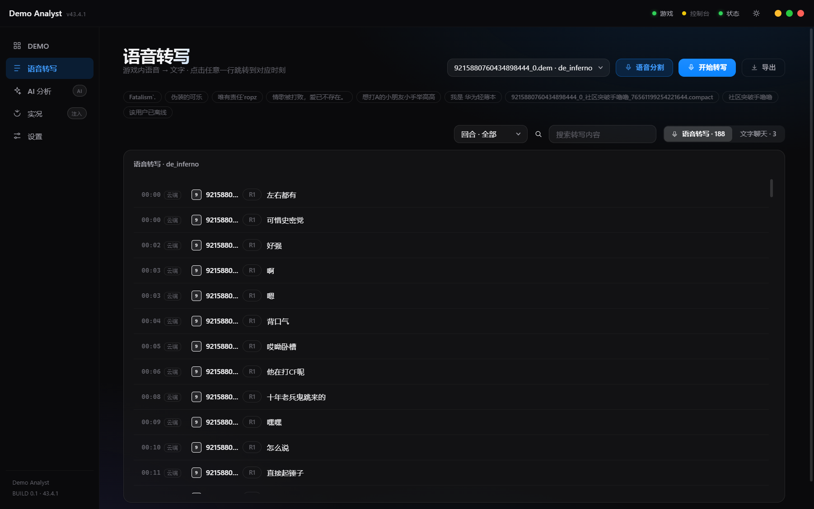

# CS2 Demo Analyst

English | [简体中文](README.md)

A CS2 demo replay tool. Drop in a .dem file and it parses score, rounds, kills and player stats; in-game voice can be transcribed to searchable text, aligned by round and time. Click a line to make CS2 jump to that moment.

Windows desktop app. Playback uses CS2's built-in player. An optional in-game voice HUD shows who is speaking while a demo plays; it restores itself on exit and does not modify the game.

## Features

- Parse .dem: score, round timeline, kills (weapon / headshot / through-smoke), player K/D/HS
- Voice transcription: per-player voice to searchable text, aligned to rounds and time (local whisper or a cloud API)
- Jump: click a transcript line, kill or round to seek the running CS2 instance
- In-game voice HUD: shows the speaking teammate at the bottom-left while playing a demo
- Ask an LLM: feed the whole match to any OpenAI-compatible model and ask about highlights, turning points, whatever

## Screenshots

| Library | Match detail | Transcript |
| --- | --- | --- |
|  |  |  |

## Install

Grab one from Releases:

- `CS2-Demo-Analyst-1.0.0-setup.exe` - installer with optional install dir and desktop shortcut
- `CS2-Demo-Analyst-1.0.0-win64-portable.zip` - portable, extract and run

Usage:

1. Launch the app and add a folder containing .dem files
2. Wait for parsing, then hit "Play in CS2" on the demo page
3. Transcription only works on demos that carry voice (FACEIT, Wanmei and other third-party recordings); Valve matchmaking demos have no voice

## Development

Read [AGENTS.md](AGENTS.md) first - current state, architecture and gotchas are documented there.

```bash
npm install
npm run dev          # dev mode
npm run build        # build
npm run dist:zip     # portable zip
```

Stack: Electron + React + TypeScript. Demo parsing via [deadem](https://github.com/Igor-Losev/deadem) (pure JS), voice extraction via csgove, transcription via whisper.cpp / Groq.

## License

MIT. Windows only.
