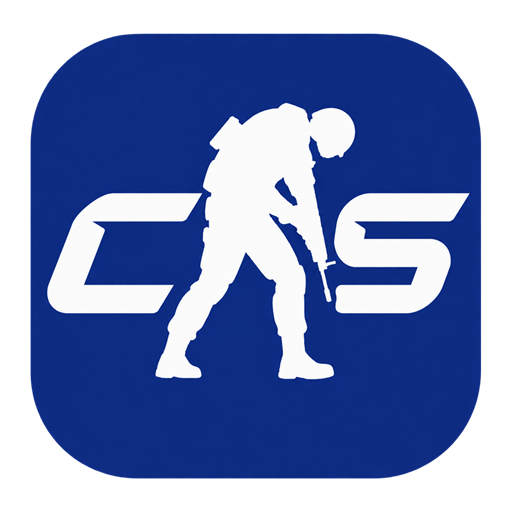
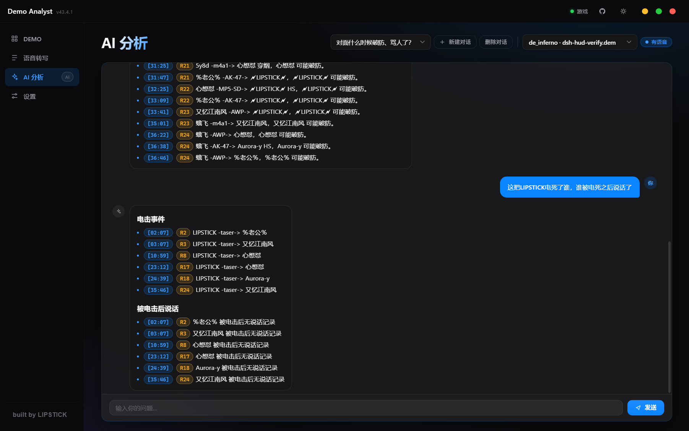

<div align="center">



# CS2 Demo Analyst

**Esports-Grade CS2 Replay Analysis Workstation**  
*Voice Transcription · Panorama Voice HUD · Lead-In Live Jump · Official Dual-Track Round Timeline · AI Match Post-Mortem*

[](https://github.com/B-LIPSTICK/cs2-demo-analyst/releases)
[](https://github.com/B-LIPSTICK/cs2-demo-analyst/releases/tag/v1.0.0)
[](https://www.electronjs.org/)
[](https://react.dev/)
[](LICENSE)

<p>
  <b>English</b> | <a href="README.md">简体中文</a>
</p>

</div>

---

## Why CS2 Demo Analyst?

Reviewing demos is the most critical pathway to improving in CS2, yet competitive players, coaches, and content creators have long been hindered by:
- **Clunky In-Game Controls**: CS2's default `Shift+F2` demo UI is notoriously laggy, difficult to scrub, and often misses critical engagement moments;
- **Silent Voice Recordings**: Standard platforms rarely replay team comms, making it impossible to audit calls, tactical executions, and miscommunications;
- **Boring Stat Tables**: Cold numerical charts fail to illustrate match momentum, clutch decisions, and turning points.

**CS2 Demo Analyst** bridges this gap: a high-performance Windows desktop application that connects directly to the running CS2 process, transforming static `.dem` replay files into **searchable, voice-transcribed, AI-diagnosed tactical intelligence with interactive live playback**.

---

## Quick Start

### Download & Run

Grab the latest release from the [Releases Page](https://github.com/B-LIPSTICK/cs2-demo-analyst/releases):

- **Portable Green Build (Recommended)**:
  Download `CS2-Demo-Analyst-1.0.0-win64-portable.zip`, extract to any directory, and double-click `CS2 Demo Analyst.exe` to start immediately. No installation required.

### Basic Workflow

1. **Add Demo Directories**: Launch the app and click "Add Folder" or "Auto-Detect Platform Dirs" to discover your Wanmei, 5E, or Steam replay directories;
2. **Instant Demo Parsing**: Parsed scores, kill feeds, and timelines are cached locally. Click any card to enter the deep-dive detail view;
3. **Live Seek with Pre-Roll**: Click any kill row or timeline icon to jump directly inside CS2 with an automatic 4-second pre-fire buffer;
4. **Voice Comms & AI Post-Mortem**:
   - Transcribe team voice comms using offline local Whisper, filterable by player and round;
   - Run AI tactical diagnostics with one click and jump to referenced rounds and timestamps instantly in-game.

---

## Interface Showcase & Previews

### 1. Official Dual-Track Round Timeline & Match Workspace

*Pixel-perfect recreation of the official CS:GO / CS2 dual-track timeline (survivor bars, 5 victory icons, half-time side swapping), linked to an interactive kill feed and comprehensive player statistics (Rating, ADR, KAST, Opening Duels).*

### 2. Demo Library & Smart Multi-Platform Management

*Auto-discovery for Wanmei, 5E, and Steam demo folders with high-speed local parsing, date/map/favorite filtering, and batch operations.*

### 3. In-Game Voice Transcription & Instant Jump

*Offline local Whisper transcription of team communications. Filter by side, player, or round, and click any line of dialogue to jump immediately to the live replay.*

### 4. AI Match Post-Mortem & Tactical Diagnostics

*Correlates entire-match kill events with player comms. Ask free or private AI models for round-by-round breakdown and click output timestamps to scrub in-game.*

---

## Key Features

### 1. Official CS:GO / CS2 Dual-Track Match Timeline Bar
- **Pixel-perfect recreation of the official esports scoreboard timeline**:
  - Dual-track split (Upper/Lower teams) with half-time side swapping (T Amber Gold / CT Frost Blue);
  - Dynamic **5-bar Survivor Indicator** to distinguish between 1vX clutch miracles and flawless 5-man retakes;
  - 5 official victory vector icons: Elimination, Bomb Exploded, Bomb Defused, Timeout, and Matchpoint Trophy;
  - Click any round or icon to filter the kill feed and highlight key duels.

### 2. 4-Second Lead-In Live Seek (Live Jump with Lead-In)
- **Firefight Pre-Roll Buffer**: Clicking any kill row, tactical event, or AI timestamp automatically seeks ~256 ticks (4 seconds) prior to the engagement, providing full context on crosshair placement, utility prep, and trades;
- **Dual-Mode Adaptive Response**:
  - **While CS2 is running**: issues `demo_gototick` via native engine console IPC for instant, seamless seeking;
  - **While CS2 is closed**: one-click launch directly boots the game and fast-forwards straight to the target tick;
  - Inspecting duels inside player popups keeps your current view uninterrupted.

### 3. In-Game Voice HUD Overlay (Valve Panorama)
- **Native Team Comm Indicators**:
  - Displays speaking teammates in the bottom-left corner of the game screen during demo playback;
  - Native rounded avatar square + team-colored handle (`color-T` / `color-CT`) + subtle glow;
  - Packed as a compliant Valve Panorama VPK (`dsh_voice_override.vpk`): **no DLL injection, no memory manipulation, 100% clean and VAC safe**.

### 4. AI-Powered Tactical Post-Mortem
- **Zero-Barrier Provider Support**:
  - Native integration for domestic free & affordable providers (Zhipu GLM-4-Flash, SiliconFlow, DeepSeek, Moonshot Kimi) alongside OpenAI-compatible APIs and local **Ollama**;
- **Interactive Timestamp Seeking**:
  - Every round tag (e.g. `R2`) and timestamp (e.g. `[02:15]`) mentioned by the AI assistant is **instantly clickable to jump in-game**;
  - Built-in prompt enforcement and OpenCC normalization for clean, natural Chinese/English output.

### 5. Minimalist Apple HUD Design System
- **Seamless Light & Dark Themes**:
  - **Light Mode**: crisp white tactile cards, subtle grey borders, high-contrast typography, and gentle micro-shadows;
  - **Dark Mode**: deep near-black glass paneling, hairline strokes, and subtle aurora gradients;
- **Pure Vector Iconography**:
  - All crude system emojis removed in favor of bespoke 1.6px stroke SVGs (Radar scanner, Defuse pliers, Timeline marks);
  - Standardized Secondary tactile button variants for a responsive, desktop-grade feel.

### 6. Platform Compatibility & Smart Normalization
- **Auto-Discovery**: One-click detection for Steam, Wanmei (PW), and 5E platform demo storage folders;
- **Weapon Normalization**: Automatically strips platform skin suffixes and perk tags (e.g. `hkp2000_txz04` → `P2000`), fully supporting Zeus, CZ75, and knife models;
- **Match Date Extraction**: Reads real match timestamps from zip entry headers and file conventions, eliminating download mtime inaccuracies.

---

## Privacy & Safety Guarantee

- **Local-First Architecture**: Your demo files, kill databases, and audio transcriptions stay strictly on your local disk;
- **VAC & Account Safety**:
  - In-game replay communication uses CS2's native console/IPC commands;
  - The voice HUD utilizes Valve's official Panorama search path priority. **No memory reading, no DLL injection, and no code tampering**.

---

## Development & Build

```bash
# Clone the repository
git clone https://github.com/B-LIPSTICK/cs2-demo-analyst.git
cd cs2-demo-analyst

# Install dependencies
npm install

# Start development mode
npm run dev

# TypeScript type check
npm run typecheck

# Build and package Windows portable ZIP
npm run build
npm run dist:zip
```

- **Tech Stack**: Electron + React 19 + TypeScript + Vite + Valve Panorama Engine
- **Engines**: [deadem](https://github.com/Igor-Losev/deadem), csgove, whisper.cpp, OpenCC

---

## License

Distributed under the [MIT License](LICENSE).

