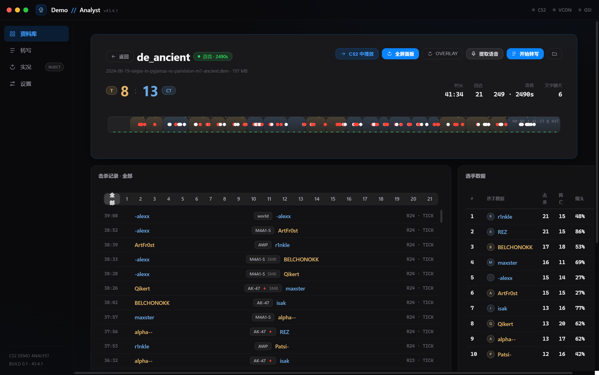
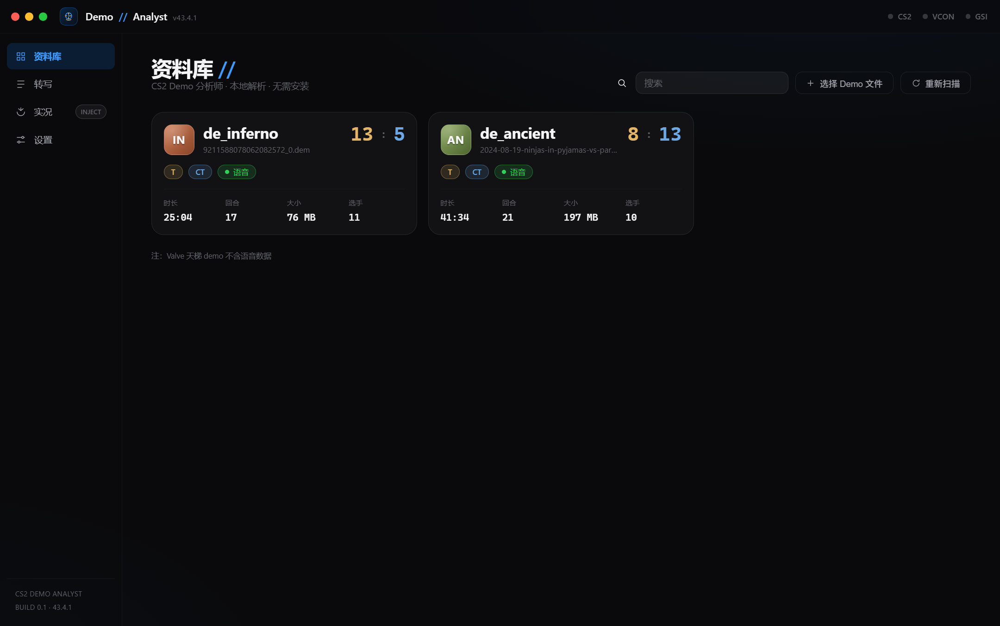
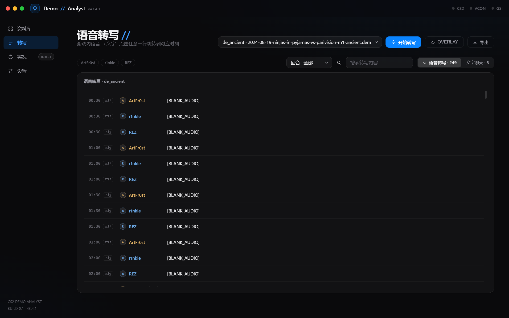
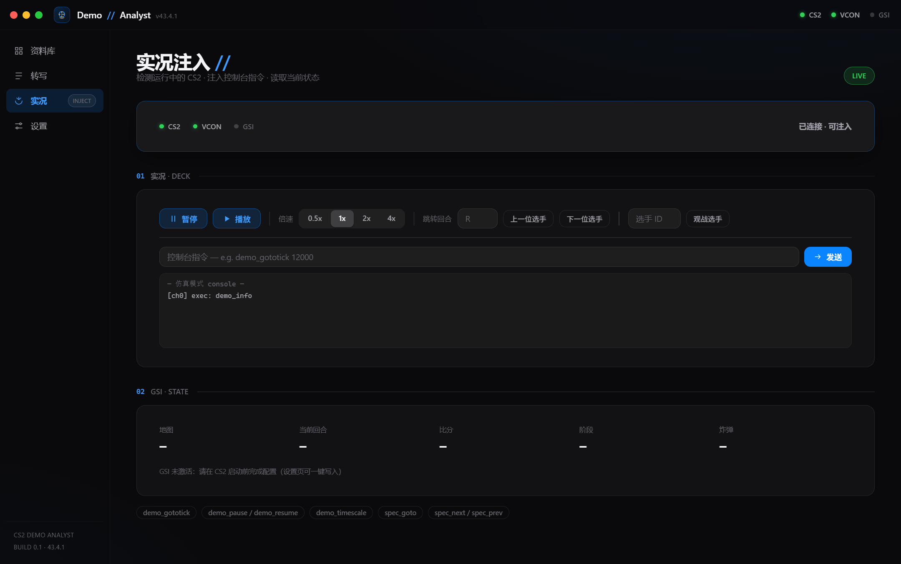
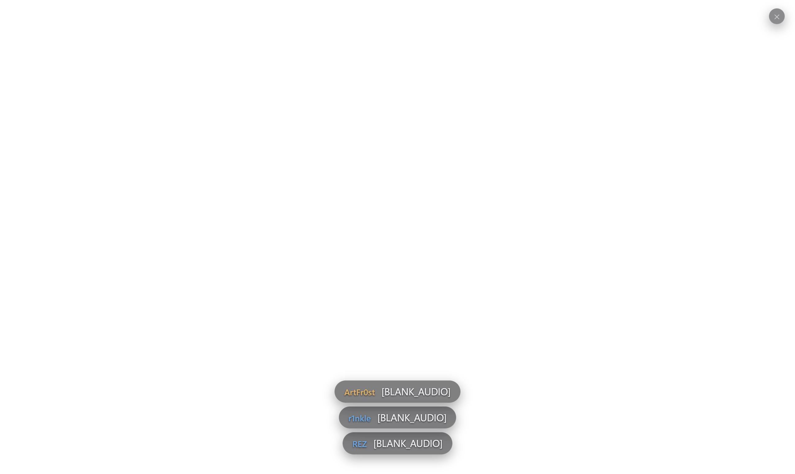

# CS2 Demo Analyst

> 挂接 CS2 的 Demo 分析师 —— 拖入 .dem 即刻分析 · 游戏语音一键转写 · 苹果风毛玻璃界面



CS2 Demo Analyst 帮助你像看职业比赛一样复盘自己的录像：**地图/比分/回合/击杀/选手数据自动解析**，**游戏内语音转成可搜索的文字**，还能在播放 demo 时**一键跳转到任意回合、击杀或语音时刻**。

这是一款作者长期自用的 CS2 复盘工具，现已开源：**不改游戏文件、不替换 CS2 播放器**，Windows 桌面绿色便携版（零安装）。

## ✨ 功能

| 功能 | 说明 |
| --- | --- |
| 🗂️ Demo 资料库 | 拖入 / 选择 / 扫描 `.dem`，本地秒级解析（76MB ≈ 1.3s） |
| 📊 自动分析 | 地图、比分、回合时间轴、击杀记录（武器/爆头/穿烟）、选手 K/D/HS/MVP |
| 🎙️ 语音检测 | 自动标记哪些 demo 含录制语音（FACEIT / 完美平台 / 本地录制通常有） |
| 📝 语音转写 | 每位玩家语音 → 带时间戳文字，与回合对齐；文字聊天同屏；一键导出 |
| 🎯 一键跳转 | 点击转写行 / 击杀 / 回合 → 向正在播放的 CS2 注入 `demo_gototick` 等指令 |
| 🤖 AI 分析 | 自己配置 Key 与模型（OpenAI 兼容），用自然语言问这局：找高光、找破防、找转折，答案时间点可点击跳转 |
| 🖥️ 实况注入 | 检测 cs2.exe，VConsole2（`-tools`）读写控制台；GSI 读取当前回合/比分/炸弹 |
| 🎮 游戏内悬浮层 | 透明置顶 HUD：说话者头像 + 声波动画 + 转写字幕（仅语音，无观战信息干扰） |
| 🎨 苹果风界面 | macOS 风格毛玻璃面板、iOS 蓝强调色、红绿灯窗口按钮、SF 系系统字体，深色/浅色双主题，中英双语 |

## 📸 界面

| 资料库 | Demo 详情 | 语音转写 |
| --- | --- | --- |
|  |  |  |

| 实况注入 | 游戏内悬浮层 | 语音大屏 |
| --- | --- | --- |
|  |  |  |

## 🚀 快速开始（Windows 绿色便携版）

1. 下载 `CS2-Demo-Analyst-<version>-win64-portable.zip`
2. 解压到任意目录，双击 `CS2 Demo Analyst.exe` 运行（免安装）
3. 「添加目录」选择你的 demo 文件夹，自动扫描解析
4. 游戏内悬浮层 Overlay、CS2 进程挂接与一键注入均为桌面版内置功能

> 小白从 0 到会的完整配置教程见 [docs/GUIDE.md](docs/GUIDE.md)（云端转写一键 Key、本地引擎下载、实况注入等）。

## 🎙️ 语音转写引擎（可一键配置）

| 引擎 | 速度 | 成本 | 说明 |
| --- | --- | --- | --- |
| ☁️ 云端（默认推荐） | 秒级 | 免费额度（Groq） | 设置页一键获取免费 Key，whisper-large-v3-turbo |
| 💻 本地 Whisper | 较慢（CPU） | 免费离线 | whisper.cpp + 模型按需下载，隐私优先 |

> 注意：**Valve 天梯（MM）demo 不包含语音数据**，语音转写仅对 FACEIT / 完美平台 / 本地录制等 demo 有效。

## 🛠️ 开发

```bash
npm install
npm run dev            # 桌面版开发（Electron，HMR）
npm run build          # 桌面版构建
npm run dist:zip       # 桌面版绿色 zip 打包（离线，秒级，免安装）
npm run smoke          # 无头冒烟测试
```

技术栈：React 19 + Vite + TypeScript · [deadem](https://github.com/Igor-Losev/deadem)（纯 JS Source2 解析）· Electron（桌面壳）· whisper.cpp / Groq（转写）· csgove（语音提取）。

架构说明与模块文档见 [docs/DEVELOPMENT.md](docs/DEVELOPMENT.md)。

## ❓ 常见问题

- **MM demo 转写没结果？** 天梯 demo 不录制语音，属正常现象。
- **语音转写很慢？** 换云端引擎（设置页一键配置），或本地模型升级 small/medium + N 卡 CUDA。
- **「实况注入」连不上？** 需要 CS2 以 `-tools` 模式启动（免费 Workshop Tools DLC），设置页可一键引导。
- **demo 拖进来没反应？** 确认文件后缀是 `.dem`；超大文件请耐心等待解析进度条。

## ⚖️ 兼容与声明

- 解析基于 CS2 demo 格式（`PBDEMS2`），游戏更新后可能需要适配。
- 本工具与 Valve / FACEIT / 完美世界**无任何关联**，非官方产品。
- 请遵守 [CS2 Fair Play Guidelines](https://blog.counter-strike.net/index.php/fair-play-guidelines/)；注入功能仅用于本地 demo 复盘。
- 所有解析、语音提取、转写均在本地完成（云端转写仅上传该段音频到你所配置的 API 服务）。

## 📄 许可

MIT。第三方组件与游戏资产遵循各自许可；本项目不包含 Valve 资源。
